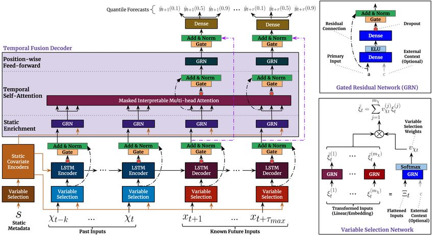

# Temporal Fusion Transformer in Pytorch



Code took and readjusted from [**mattsherar**/**Temporal_Fusion_Transform**](https://github.com/mattsherar/Temporal_Fusion_Transform).

### Abstract

> Multi-horizon forecasting problems often contain a complex mix of inputs -- including static (i.e. time-invariant) covariates, known future inputs, and other exogenous time series that are only observed historically -- without any prior information on how they interact with the target. While several deep learning models have been proposed for multi-step prediction, they typically comprise black-box models which do not account for the full range of inputs present in common scenarios. In this paper, we introduce the Temporal Fusion Transformer (TFT) -- a novel attention-based architecture which combines high-performance multi-horizon forecasting with interpretable insights into temporal dynamics. To learn temporal relationships at different scales, the TFT utilizes recurrent layers for local processing and interpretable self-attention layers for learning long-term dependencies. The TFT also uses specialized components for the judicious selection of relevant features and a series of gating layers to suppress unnecessary components, enabling high performance in a wide range of regimes. On a variety of real-world datasets, we demonstrate significant performance improvements over existing benchmarks, and showcase three practical interpretability use-cases of TFT.

Official [paper](https://arxiv.org/pdf/1912.09363).

## Quickstart

Clone the repo

    git clone https://github.com/paolodelia99/Temporal-Fusion-Transfomer-pytorch.git

The model is present in the `tft.model` module while the `TSDataset` is present the `tft.utils` module.
Here's an example of their usage:

```python
from tft.model import TFT, QuantileLoss
from tft.utils import TSDataset

trainset = TSDataset(data=price_df[0:last_train_idx], target=target_df[0:last_train_idx],
                     static_cols=static_cols, input_cols=input_cols,
                    input_timesteps=input_timesteps, output_timesteps=output_timesteps, 
                     encoder_len=encoder_len)

static_cols = ['working_day']
categorical_cols = ['hour', 'month', 'weekday']
real_cols = cols_to_keep
config = {
    'static_variables': len(static_cols),
    'time_varying_categorical_variables': len(categorical_cols),
    'time_varying_real_variables_encoder': len(real_cols),
    'time_varying_real_variables_decoder': len(real_cols) - 1,
    'num_masked_series': 1,
    'static_embedding_vocab_sizes': [2],
    'time_varying_embedding_vocab_sizes': [12, 24, 7],
    'embedding_dim': 8,
    'lstm_hidden_dimension': 160,
    'lstm_layers': 1,
    'dropout': 0.05,
    'device': device,
    'batch_size': 64,
    'encode_length': 168,
    'attn_heads': 4,
    'num_quantiles': 3,
    'valid_quantiles': [0.1, 0.5, 0.9],
    'seq_length': 192
}
num_outputs = 24
epochs = 25
lr = 0.000115696
loss_fn = QuantileLoss(config['valid_quantiles'])
model = TFT(config)
model = model.to(device)
model.apply(init_xuniform)
optimizer = torch.optim.Adam(model.parameters(), lr=lr)


# train loop
 for epoch in range(epochs):
    model.train()

    for batch_S, batch, batch_labels in DataLoader(trainset, batch_size,
                                                   shuffle=True,
                                                   num_workers=0,
                                                   drop_last=True):
        # your trainig code
```


## Example Notebooks

- [Italian Electricity Price forecasting](notebooks/electricity-prices-forecasting.ipynb)

## Author 

Paolo D'Elia
